# HandsOn_SOC_Automation1
Hands on SOC automation project using wazuh, thehive, shuffle, and virustotal for detecting and blocking multiple SSH authentication failures by any IP.

## Introduction
This project sets up a workflow for handling SSH brute force activities on an *AWS EC2 Ubuntu machine using Wazuh, Shuffle, VirusTotal, and TheHive.* The workflow includes automatic alerting, enrichment, notification, and response.

## Objectives

1. Create an AWS EC2 Ubuntu machine with specific specifications.
2. Install Wazuh agent on the Ubuntu machine to monitor SSH brute force activity.
3. Push all level 10 custom alerts to Shuffle.
4. Perform IP enrichment using VirusTotal.
5. Send details via email to the user asking to block the source IP.
6. Create an alert in TheHive.
7. Automatically block the IP if the user confirms using the active-response/firewall-drop0 command.


## Prerequisites
1. Ubuntu Server (minimum specifications: 1GB RAM, 25GB HDD) 
2. Wazuh manager installed and configured
3. Shuffle installed and configured
4. VirusTotal API key
5. Email server configured
6. TheHive installed and configured

## Steps

### 1. Create Ubuntu Machine

- Use AWS to launch an Ubuntu instance.

- Select the lowest specifications (e.g., 1GB RAM, 25GB HDD).

- Configure the network to allow all inbound traffic (for testing purposes).

### 2. Install Wazuh Agent on Ubuntu

- Click on deploy a new agent in Wazuh-manager dashboard.

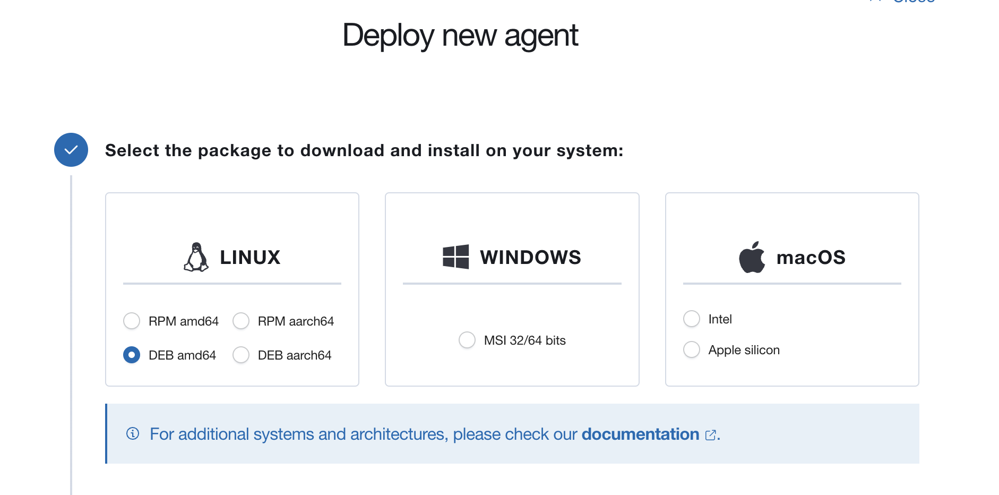

- Select DEB amd 64 for Ubuntu.

- Provide wazuh-server IP address.

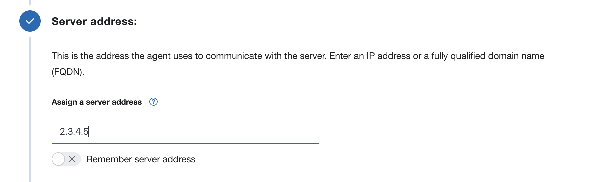

- Give an agent name.

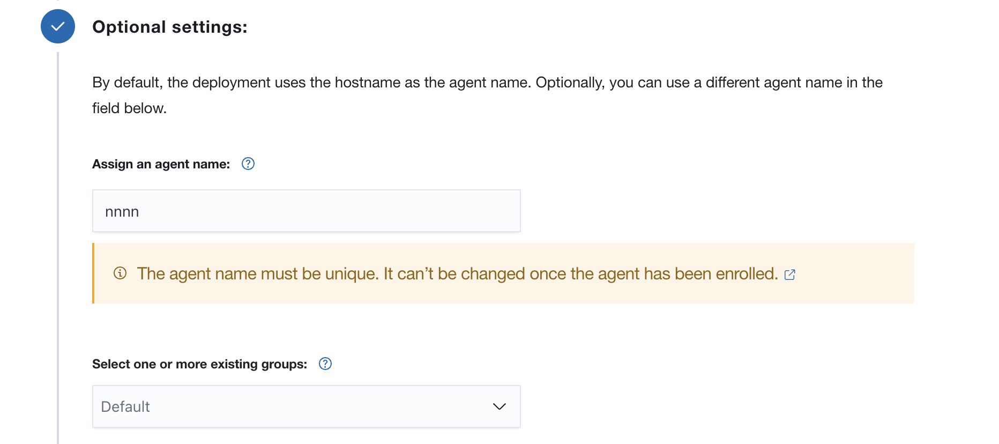


- Copy the command provided in wazuh-manager to install the wazuh-agent on ubuntu machine and start the wazuh-agent

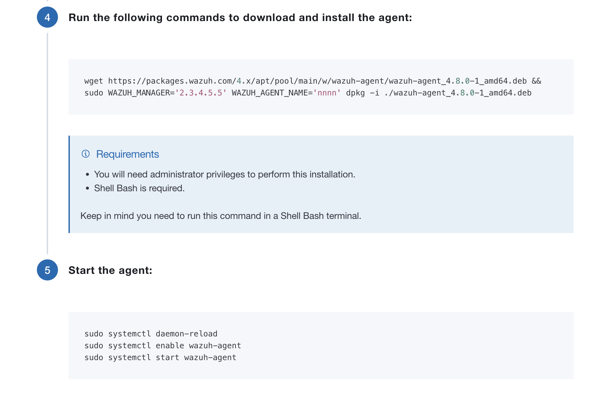

```bash
wget https://packages.wazuh.com/4.x/apt/pool/main/w/wazuh-agent/wazuh-agent_4.8.0-1_amd64.deb && sudo WAZUH_MANAGER='2.3.4.5.5' WAZUH_AGENT_NAME='nnnn' dpkg -i ./wazuh-agent_4.8.0-1_amd64.deb


sudo systemctl start wazuh-agent
sudo systemctl enable wazuh-agent

```

- Verify the agent connection:
    - On the Wazuh manager, use manage_agents to list the agents and ensure the new agent is listed as "active".

### 3. Push All LEVEL 10 Custom Alerts to Shuffle

- Create a custom rule for SSH brute force detection:
    - Edit the /var/ossec/etc/rules/local_rules.xml file on the Wazuh manager:

```xml

<group name="syslog,sshd,">
  <rule id="100005" level="10" frequency="4" timeframe="60">
    <if_matched_sid>5710</if_matched_sid>
    <same_source_ip/>
    <description>sshd:Invalid user trying to gain access</description>
    <mitre>
      <id>T1110</id>
    </mitre>
    <group>authentication_failures,gdpr_IV_35.7.d,gdpr_IV_32.2,hipaa_164.312.b,nist_800_53_SI.4,nist_800_53_AU.14,nist_800_53_AC.7,pci_dss_11.4,pci_dss_10.2.4,pci_dss_10.2.5,tsc_CC6.1,tsc_CC6.8,tsc_CC7.2,tsc_CC7.3,</group>
  </rule>
</group>
```

- Restart the Wazuh manager:

```bash

sudo systemctl restart wazuh-manager
``

- Configure Wazuh to send alerts to Shuffle:

    - Edit the /var/ossec/etc/ossec.conf file on the Wazuh manager:

```xml

<integration>
    <name>shuffle</name>
    <hook_url>SHUFFLE_URL</hook_url>
    <rule_id>100005</rule_id>
    <alert_format>json</alert_format>
  </integration>
```
- Replace SHUFFLE_URL with your Shuffle endpoint URL.


### 4. Perform IP Enrichment with VirusTotal

- Configure Shuffle to use VirusTotal API:

    - Go to your Shuffle instance.
    - Add a new app with VirusTotal API.
    - Provide your VirusTotal API key in the app configuration.

- Create a workflow in Shuffle for IP enrichment:

    - Use the VirusTotal app to query IP reputation.
    - Parse the response and include it in the alert details.

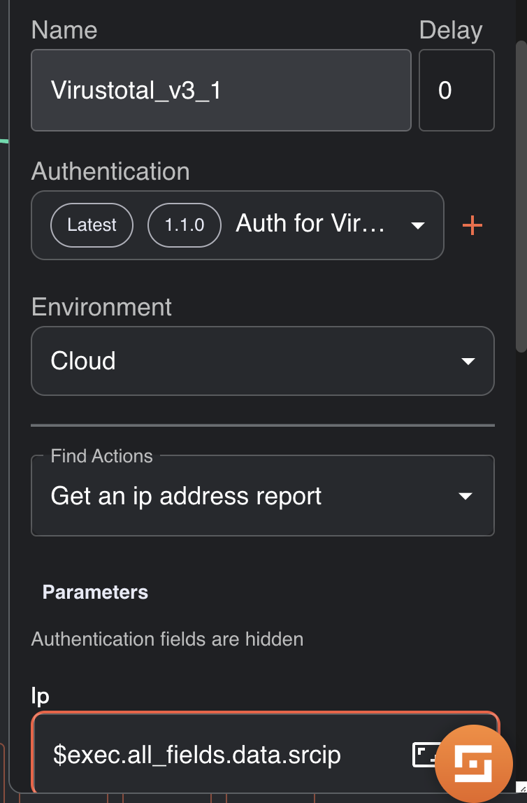
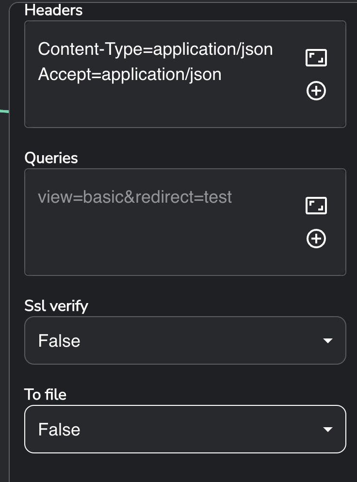

### 5. Send Details via Email to the User for an input

- Configure email integration in Shuffle:

    - Add an email app in Shuffle.
    - Configure it with your email server settings.

- Create a workflow to send email alerts:

    - Use the email app to send alert details to a designated user.
    - Include a request for the user to confirm if the IP should be blocked.

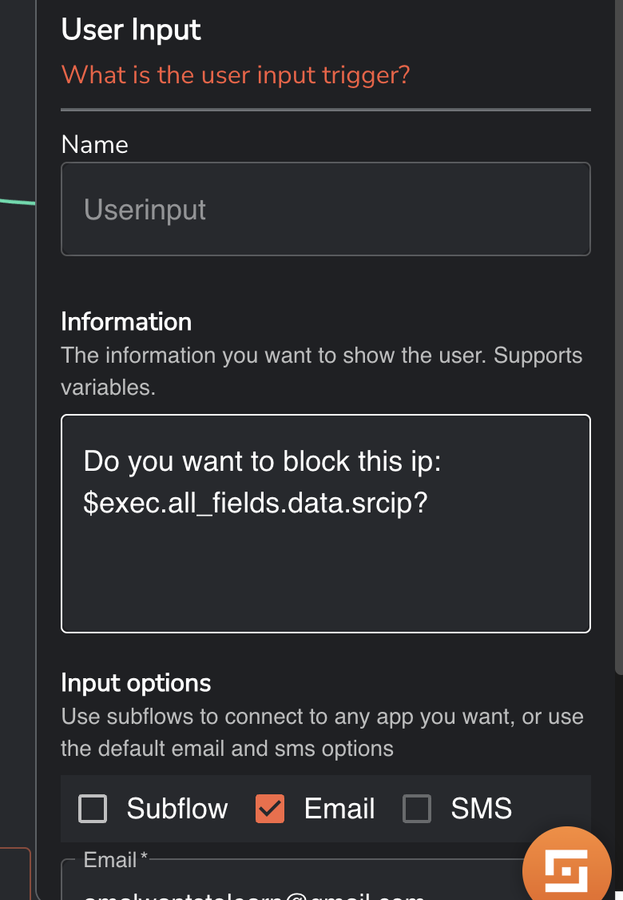

### 6. Create an Alert in TheHive

- Configure TheHive integration in Shuffle:

    - Add TheHive app in Shuffle.
    - Provide TheHive API key and URL in the app configuration.

- Create a workflow to create alerts in TheHive:

    - Use TheHive app to create a new alert with the enriched details from VirusTotal and the SSH brute force activity.

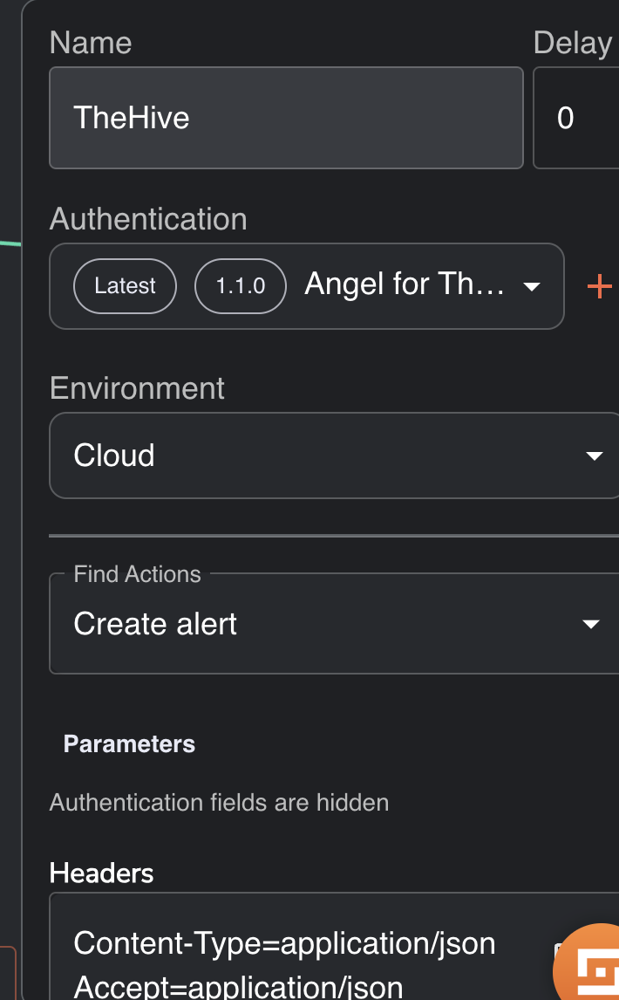
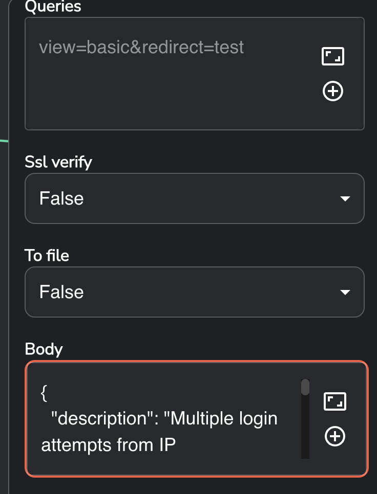


### 7. Automatically Block IP if User Confirms

- Configure active response on Wazuh manager:
    - Edit the /var/ossec/etc/ossec.conf file:

```xml

<active-response>
  <command>firewall-drop</command>
  <location>local</location>
  <level>10</level>
  <timeout>no</timeout>
</active-response>
```
- Create a workflow in Shuffle to handle user confirmation:

    - Use a conditional step to check if the user confirms the IP block.
    - If confirmed, trigger an active response on the Wazuh manager using the firewall-drop0 command.


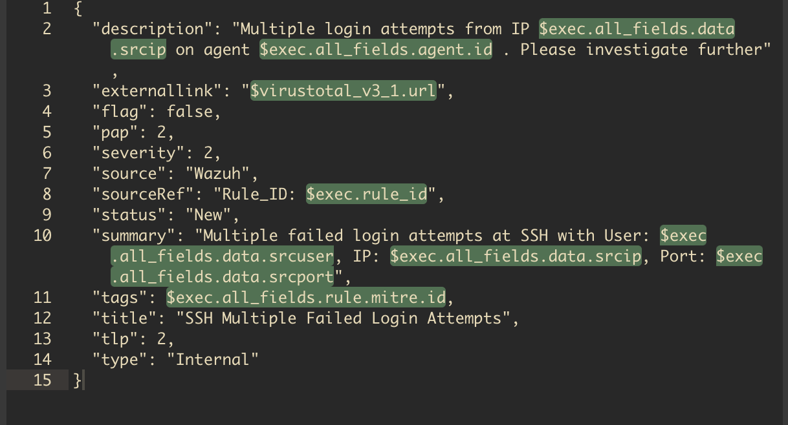


## Result

1. Flow Diagram in shuffle


2. Alert in Wazuh 

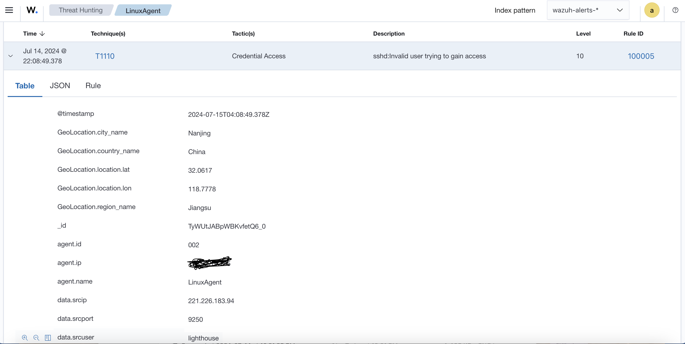
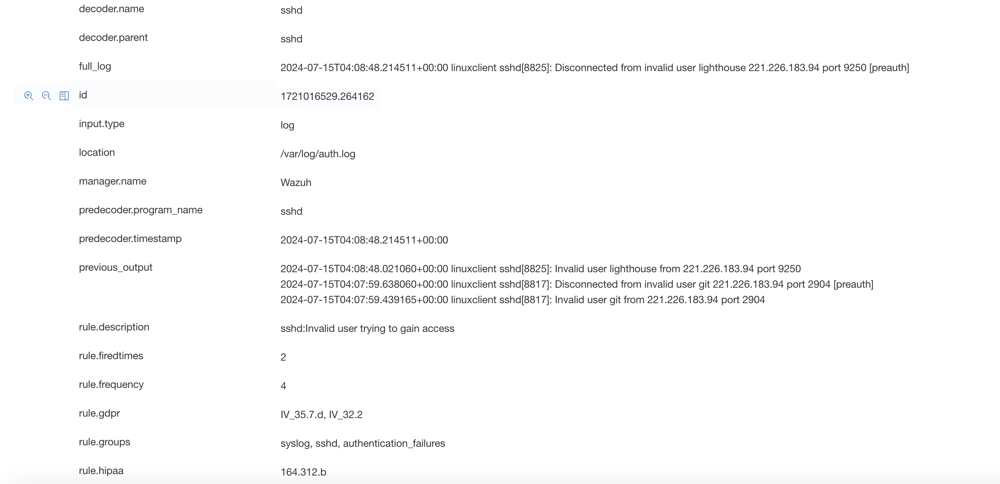
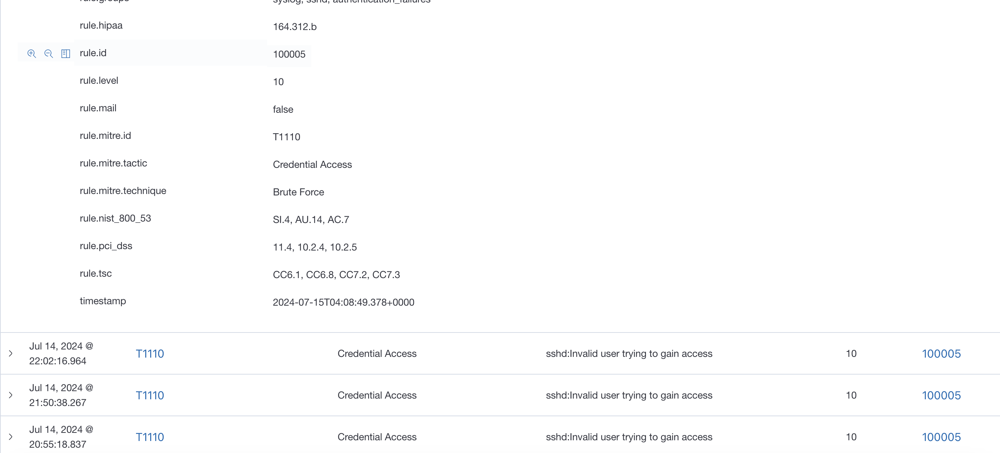


3. Email to get userinput

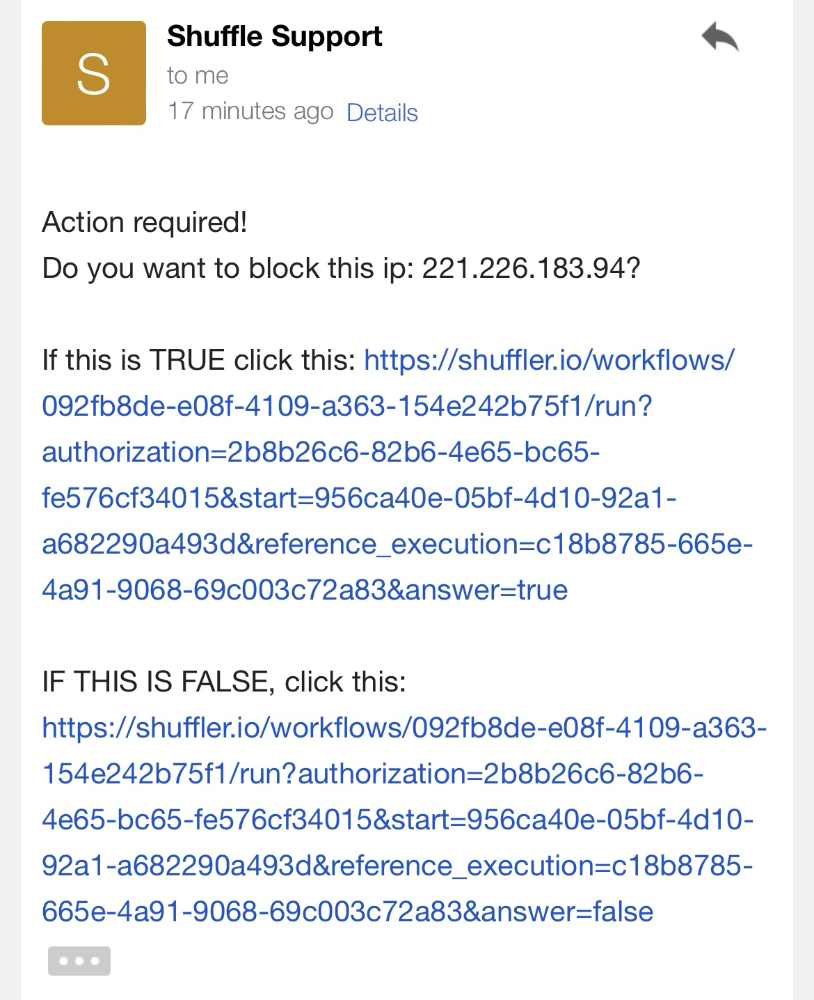
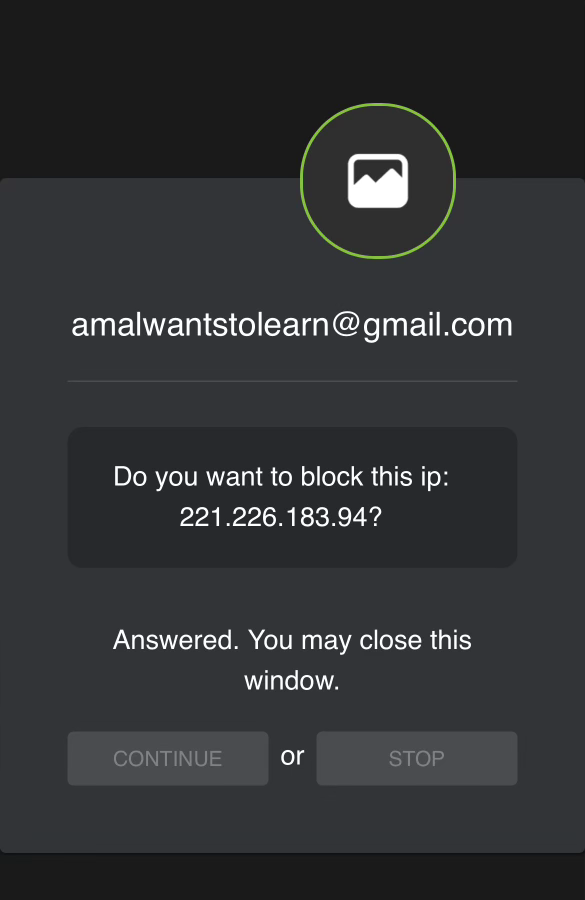


4. Blocked list in ubuntu machine iptables

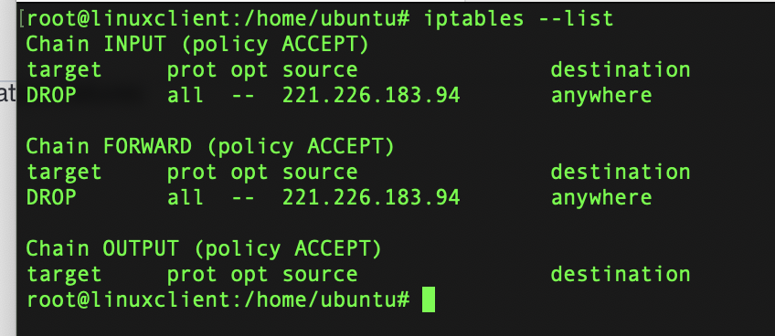

5. Alert in Thehive

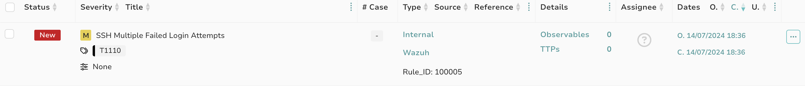


## License
This project is licensed under the MIT License. See the LICENSE file for details.

